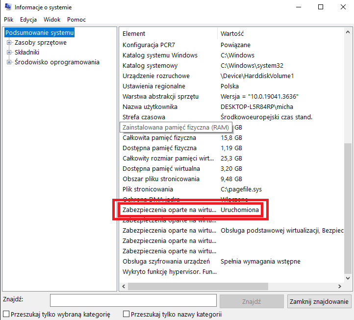
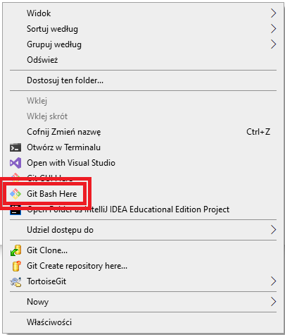
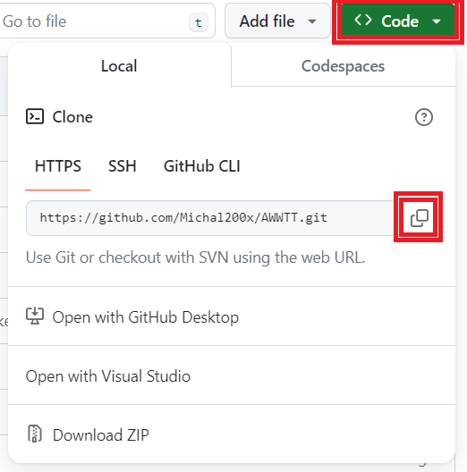
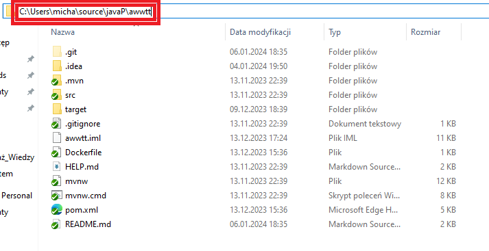

# Uruchomienie aplikacji AWWTT

Ten przewodnik pokaże, jak uruchomić aplikację przy użyciu Dockera, od instalacji Dockera do uruchomienia aplikacji.

## Instalacja Docker (Ten krok wykonujemy włącznie kiedy nie mamy zainstalowanej aplikacji Docker desktop)

1. Wcelu umożliwienia aplikacji Docker poprawnego działania włącz wirtualizację w ustawieniach BIOS jeśli nie masz jej włączonej skorzyystaj z [podradnika](https://www.docker.com/get-started/)
    - Aby sprawdzić czy masz włączoną wirtualizację wpisz informacje o systemie w pasek wyszukiwania windows a następnie przejdź na sam dół strony
    - Sprawdz czy jak na zdięciu poniżej pisze uruchomiona

    

2. Pobierz **Docker Desktop** z [oficjalnej strony](https://www.docker.com/get-started/).
3. Zainstaluj pobrany program, postępując zgodnie z instrukcjami instalatora.
4. Następnie otwórz aplikację i utwórz konto lub kontynułuj bez logowania

## Instalacja Git (Ten krok wykonujemy włącznie kiedy nie mamy zainstalowanej aplikacji Git)

1. Pobierz **Git** z [oficjalnej strony](https://git-scm.com/downloads).
2. Zainstaluj pobrany program, postępując zgodnie z instrukcjami instalatora.

## Uruchomienie Aplikacji

## 1. Pobranie i zapisanie aplikacji na twoim kompiterze
1. Utwórz i wejdz do katalogu w którym chcesz zapisać aplikację
2. W folderze otwórz git bash zrobisz to klikając prawym przyciskiem myszy na pustą przestrzeń w katalogu:



3. Otwórz Github na [stronie aplikacji](https://github.com/Michal200x/AWWTT/tree/master)
4. Skopiuj link do pobrania aplikacji:



5. W okno git bash wpisz komendę poniżej i pod link podstaw link skopiowany z github:
```
git clone link
```

6. Aplikacja została zapisana w podanym katalogu

### 2. Budowanie Obrazu Docker
1. Uruchom Docker desktop (aplikację którą przed chwilą instalowałeś/aś)
2. Otwórz terminal aby to zrobić wejdz w pasek wyszukiwania w windows, a następnie wpisz "cmd" lub "Wiersz polecenia"
3. Przejdź do katalogu projektu, aby to zrobić w otworzony terminalu wpisz komendę:
   ```
   cd C:\sciezka\do\glownego\katalogu\aplikacji
   ```
   

   Za ścieżkę po "cd" przekopiuj ścieżkę z katalogu gdzie zapisałeś/aś aplikację

4. Zbuduj obraz Docker swojej aplikacji wpisz komendę:
   ```
   docker build -t awwtt .
   ```

### 3. Uruchamianie zbudowanej aplikacji
Uruchom kontener(zbudowana aplikacja) przy użyciu komendy:
```
docker run -p 8080:8080 awwtt
```
Port 8080 kontenera zostanie przekierowany na port 8080 Twojego local hosta, czyli aplikacja teraz otiera się w twojej przeglądarce pod adresem "http://localhost:8080".

### 4. Otwarcie Aplikacji
Twoja aplikacja powinna być teraz dostępna pod adresem `http://localhost:8080` [link do aplikacji](http://localhost:8080).